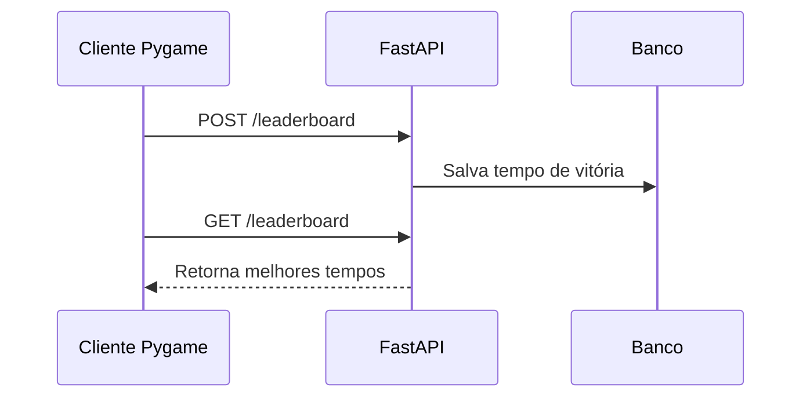
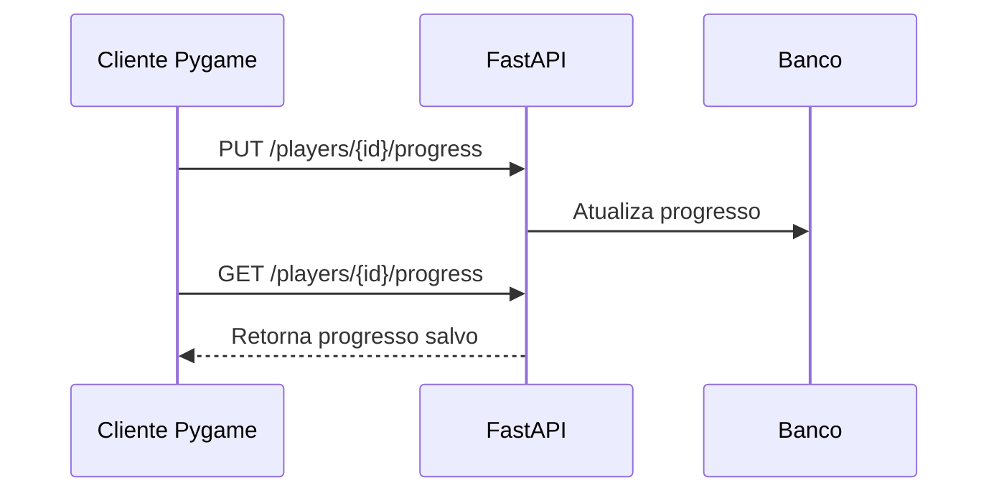

# API, banco de dados e multiplayer

## Papel da API

A API é a camada responsável por receber requisições do cliente, validar regras e gravar dados no banco. O jogo se comunica com ela por HTTP.

## Entidades persistidas

### Ranking

Armazena os melhores tempos de conclusão do jogo.

Campos principais:

- `player_name`
- `elapsed_seconds`
- `completed_at`

### Progresso do jogador

Armazena o estado necessário para continuar a sessão ou entrar no multiplayer.

Campos principais:

- `player_id`
- `player_name`
- `zone_id`
- `position_x`
- `position_y`
- `items`
- `team`

### Multiplayer

Armazena fila, partida e histórico de ações.

Tabelas principais:

- `multiplayer_tickets`
- `multiplayer_matches`
- `multiplayer_actions`

## Fluxo de ranking



## Fluxo de progresso



## Fluxo multiplayer

1. O cliente envia o time atual do jogador para `/multiplayer/matchmaking/join`.
2. A API cria um ticket de fila.
3. Quando há dois tickets compatíveis, a API cria uma partida.
4. Cada cliente consulta o status até receber `match_id`.
5. A batalha passa a ser sincronizada por polling.
6. Cada ação enviada contém tipo de ação e, opcionalmente, `action_id`.
7. A API valida se é a vez do jogador, aplica a regra e grava o novo snapshot.
8. O outro cliente lê o estado atualizado pela rota da partida.

## Ações multiplayer

| Ação | Efeito |
| --- | --- |
| `basic_attack` | Aplica dano básico ao Pokémon ativo do oponente |
| `special_attack` | Aplica dano especial ao Pokémon ativo do oponente |
| `heal` | Usa item de cura no Pokémon ativo |
| `switch` | Troca o Pokémon ativo |
| `leave` | Encerra participação na partida |

## Por que REST com polling

O multiplayer usa REST com polling para manter a primeira versão simples, fácil de hospedar e fácil de demonstrar. A estrutura de gateway e serviço permite evolução futura para WebSocket sem reescrever as regras centrais.

## Endpoints principais

```text
GET  /health
GET  /health/ready
GET  /leaderboard
POST /leaderboard
GET  /leaderboard/page?limit=10&offset=0
PUT  /players/{player_id}/progress
GET  /players/{player_id}/progress
POST /multiplayer/matchmaking/join
GET  /multiplayer/matchmaking/status/{ticket_id}
GET  /multiplayer/matches/{match_id}
POST /multiplayer/matches/{match_id}/actions
POST /multiplayer/matches/{match_id}/leave
```
