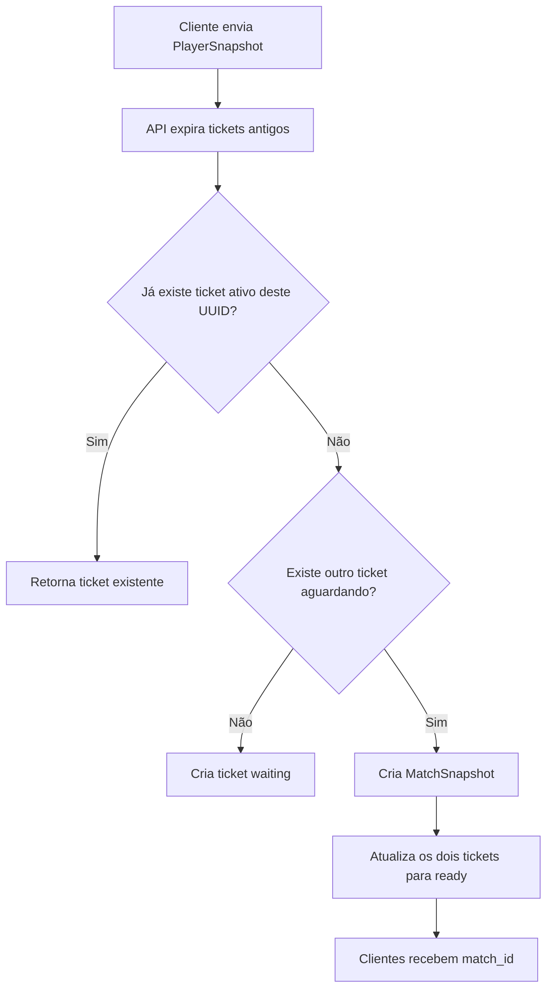

# API, banco de dados e multiplayer

## Responsabilidades

A API é a fronteira entre o cliente e os dados persistentes. Ela:

- valida payloads com Pydantic;
- aplica regras do multiplayer;
- controla fila e turno;
- grava ranking, progresso, partidas e ações;
- devolve snapshots serializáveis ao cliente.

O cliente Pygame não acessa PostgreSQL diretamente.

## Ambientes

```text
Produção: executável -> Render -> Supabase PostgreSQL
Local: cliente Python -> FastAPI/Docker -> MySQL
Testes: pytest -> FastAPI -> SQLite em memória
```

A camada SQLAlchemy mantém as regras de persistência independentes do banco usado no ambiente.

## Dados persistidos

### `leaderboard_scores`

| Campo | Uso |
| --- | --- |
| `id` | chave primária |
| `player_name` | nome exibido |
| `elapsed_seconds` | tempo total |
| `created_at` | registro da conclusão |

Somente conclusões entram no ranking.

### `player_progress`

| Campo | Uso |
| --- | --- |
| `player_id` | identificador persistente |
| `player_name` | nome exibido |
| `zone_index`, `x`, `y` | posição |
| `items` | inventário JSON |
| `team` | time e atributos JSON |
| `updated_at` | última atualização |

### Multiplayer

- `multiplayer_tickets`: entrada na fila e vínculo com `match_id`;
- `multiplayer_matches`: snapshot autoritativo;
- `multiplayer_actions`: ações únicas identificadas por `action_id`.

## Identidade no multiplayer

Há duas identidades com finalidades diferentes:

```text
player_name              nome visível
multiplayer_player_id    UUID exclusivo da instância
```

O UUID evita colisões quando duas janelas usam o mesmo nome. O identificador persistente do progresso continua separado da identidade efêmera de rede.

## Matchmaking



A procura exclui somente o UUID do próprio cliente. Nomes iguais não interferem no pareamento.

O cliente cancela o ticket ao sair do lobby. Tickets sem atividade também expiram, evitando que uma entrada antiga bloqueie a fila.

## Estado autoritativo

Cada partida armazena:

- jogadores e times;
- Pokémon ativo;
- HP;
- itens;
- carga do especial;
- jogador ativo;
- número do turno;
- vencedor;
- eventos recentes.

O servidor recebe uma intenção, valida o estado atual e salva o snapshot resultante. O cliente não envia o dano final.

## Regras de ataque

```text
normal_attack_count = 0 -> ataque básico disponível
normal_attack_count = 1 -> ataque básico disponível
normal_attack_count = 2 -> ataque especial obrigatório
ataque especial          -> carga volta para 0
```

O servidor rejeita:

- especial sem duas cargas;
- básico quando o especial está pronto;
- ação fora do turno;
- ação de jogador fora da partida;
- cura sem poção;
- troca inválida.

O dano especial é calculado sobre a faixa especial e recebe multiplicador `1.35`.

## Idempotência

Toda ação possui `action_id`. Antes de processar uma ação, a API verifica se esse identificador já existe em `multiplayer_actions`. Uma repetição causada por retry HTTP não aplica dano duas vezes.

## Endpoints

### Saúde

```text
GET /health
GET /health/ready
```

`/health/ready` abre uma conexão com o banco e deve ser usado antes de testes online.

### Ranking

```text
GET  /leaderboard?limit=10
GET  /leaderboard/page?limit=10&offset=0
POST /leaderboard
```

Exemplo:

```json
{
  "player_name": "Treinador",
  "elapsed_seconds": 542
}
```

### Progresso

```text
GET /players/{player_id}/progress
PUT /players/{player_id}/progress
```

### Multiplayer

```text
POST /multiplayer/matchmaking/join
GET  /multiplayer/matchmaking/status/{ticket_id}
POST /multiplayer/matchmaking/{ticket_id}/cancel
GET  /multiplayer/matches/{match_id}
POST /multiplayer/matches/{match_id}/actions
POST /multiplayer/matches/{match_id}/leave
```

Exemplo de ação:

```json
{
  "player_id": "uuid-da-instancia",
  "action_type": "attack",
  "payload": {
    "attack_index": 0
  },
  "action_id": "uuid-da-acao"
}
```

## Polling

O cliente consulta ticket e partida em intervalos controlados. REST com polling foi escolhido para manter deploy e depuração simples em hospedagem gratuita. Os contratos `MultiplayerGateway` e `MatchSnapshot` permitem trocar o transporte por WebSocket sem mover as regras de combate para a UI.

## CORS

O cliente desktop não depende de CORS, mas a API mantém origens configuráveis para Swagger e clientes web. Em produção com `["*"]`, credenciais CORS permanecem desativadas. Credenciais do Supabase nunca são enviadas ao cliente.

## Verificação prática

```powershell
python scripts/check_online_api.py
python scripts/check_online_api.py --write-test-score
```

O segundo comando cria uma entrada `HealthCheck` em `leaderboard_scores`.
