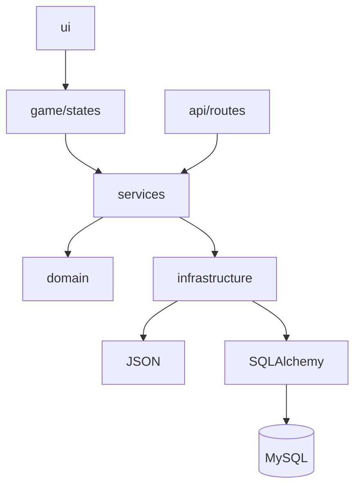

# Arquitetura do PokePY

PokePY usa arquitetura em camadas para separar jogo, domínio, regras de negócio, infraestrutura e API. A separação melhora legibilidade, testabilidade e evolução do projeto.

## Visão geral das camadas



## Responsabilidades

| Camada | Responsabilidade |
|---|---|
| `domain` | Entidades, snapshots, enums e modelos centrais |
| `services` | Regras de negócio independentes de framework |
| `infrastructure` | Persistência, HTTP client, assets e integrações externas |
| `ui` | Renderização Pygame e componentes visuais |
| `game` | Fluxo da aplicação, state machine e transições |
| `api` | Interface HTTP, validação, schemas e rotas |
| `tests` | Testes unitários e de integração |

## State Machine

O fluxo do jogo é controlado por estados especializados.

```text
PlayerNameState
TeamSelectionState
ExplorationState
InventoryState
BattleState
LeaderboardState
MultiplayerLobbyState
MultiplayerBattleState
```

Cada estado processa eventos, chama serviços e delega desenho para a camada `ui`.

## Services

Serviços concentram regras de negócio e evitam que a API ou o Pygame tenham regras duplicadas.

```text
BattleEngine
EncounterService
LeaderboardService
PlayerProgressService
MultiplayerService
MultiplayerBattleRules
```

## Repositories e gateways

Persistência e comunicação externa ficam atrás de contratos.

```text
JsonLeaderboardRepository
ApiLeaderboardRepository
SQLAlchemyLeaderboardRepository
JsonPlayerProgressRepository
ApiPlayerProgressRepository
SQLAlchemyPlayerProgressRepository
ApiMultiplayerGateway
SQLAlchemyMultiplayerRepository
```

Esse desenho permite trocar JSON por API, API por MySQL ou HTTP polling por WebSocket com menor impacto no restante do sistema.

## Backend

A aplicação FastAPI é montada em `PokePY/api/application.py`. Rotas são separadas por domínio:

```text
health.py
leaderboard.py
progress.py
multiplayer.py
```

Schemas ficam em `schemas.py`, conversões em `converters.py`, configurações em `settings.py` e handlers em `errors.py`.

## Banco de dados

O banco é acessado pela infraestrutura SQLAlchemy. A API usa repositories e os repositories usam sessions de banco.

```text
API Route -> Service -> SQLAlchemy Repository -> Session -> MySQL
```

## Multiplayer

O multiplayer usa servidor autoritativo. O cliente envia ações e recebe snapshots. A API valida turno, aplica ação, registra histórico e atualiza a partida.

Conceitos aplicados:

- Matchmaking por fila.
- Snapshot de jogador e partida.
- Turno ativo controlado pelo servidor.
- Idempotência por `action_id`.
- Registro de ações.
- Polling HTTP.

## Decisões arquiteturais

### Por que manter o jogo desacoplado da API?

O jogo precisa funcionar offline para desenvolvimento e demonstração local. A integração remota entra por gateways e repositórios, sem contaminar as regras do jogo.

### Por que usar JSON local e MySQL?

JSON oferece execução simples sem servidor. MySQL mostra persistência real para API, ranking, progresso e multiplayer. As duas formas coexistem por meio de contratos.

### Por que usar polling no multiplayer?

Polling reduz complexidade inicial e facilita testes com HTTP comum. A divisão em gateway e serviço permite migração futura para WebSocket.

### Por que separar `MultiplayerService` de `MultiplayerBattleRules`?

`MultiplayerService` coordena fila, partida e persistência. `MultiplayerBattleRules` aplica ações de batalha. Essa separação reduz tamanho de arquivos e melhora testabilidade.
