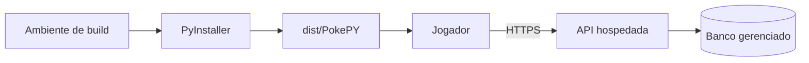

# Guia de distribuição por executável

## Objetivo

Este guia descreve a geração de um pacote executável do cliente PokePY. O pacote inclui o jogo, dependências e assets necessários para execução pelo jogador final.

O executável não contém servidor de banco de dados. Ranking, progresso online e multiplayer usam uma API hospedada. Essa abordagem evita expor credenciais, simplifica a instalação e mantém os dados centralizados.

## Modelo de distribuição



## Pré-requisitos para gerar executável

- Python 3.11+.
- Git.
- Dependências de build em `requirements-build.txt`.
- API hospedada ou API local para testes.

## Build no Windows

```powershell
python -m venv .venv
.\.venv\Scripts\Activate.ps1
python -m pip install --upgrade pip
pip install -r requirements-build.txt
python scripts/build_executable.py --api-url https://sua-api.onrender.com
```

Atalho:

```powershell
.\scripts\build_windows.ps1 -ApiUrl "https://sua-api.onrender.com"
```

## Build no Linux/macOS

```bash
python -m venv .venv
source .venv/bin/activate
python -m pip install --upgrade pip
pip install -r requirements-build.txt
python scripts/build_executable.py --api-url https://sua-api.onrender.com
```

Atalho:

```bash
./scripts/build_linux.sh https://sua-api.onrender.com
```

## Saída do build

```text
dist/
  PokePY.exe        # Windows em modo onefile
```

ou, em Linux/macOS:

```text
dist/
  PokePY
```

## Configuração embutida

Durante o build, o script cria:

```text
build/runtime/pokepy_client.json
```

Conteúdo típico:

```json
{
  "backend_mode": "api",
  "leaderboard_backend": "api",
  "progress_backend": "api",
  "multiplayer_backend": "api",
  "api_base_url": "https://sua-api.onrender.com",
  "api_timeout_seconds": 8,
  "api_json_fallback": true
}
```

Esse arquivo é empacotado no executável. Variáveis de ambiente ainda podem sobrescrever a configuração quando necessário.

## Persistência local do executável

Em builds congelados, saves locais usam uma pasta de dados do usuário:

| Sistema | Pasta típica |
|---|---|
| Windows | `%APPDATA%/PokePY/saves` |
| macOS | `~/Library/Application Support/PokePY/saves` |
| Linux | `~/.local/share/PokePY/saves` |

Isso evita gravar dentro da pasta temporária do PyInstaller.

## Teste recomendado antes de publicar

1. Rodar a API hospedada.
2. Validar `/health`.
3. Gerar executável com a URL pública da API.
4. Abrir duas instâncias do executável.
5. Concluir uma run para validar ranking.
6. Fechar e abrir novamente para validar progresso.
7. Entrar no modo multiplayer com duas instâncias.
8. Enviar ataque, cura, troca e saída de partida.

## Checklist de release

- API pública funcionando.
- `render.yaml` sincronizado com o repositório.
- `requirements-api.txt` atualizado.
- Testes passando.
- Executável gerado em máquina limpa.
- README com URL correta de demonstração, se aplicável.
- Tag de release criada no GitHub.
- Arquivo `.zip` do executável anexado à release.
