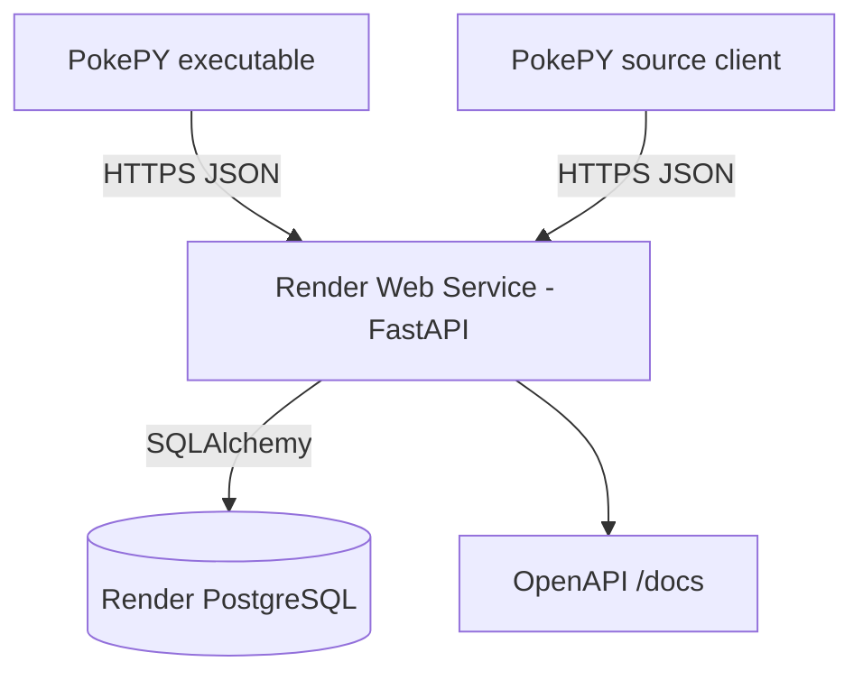

# Deploy da API no Render

## Objetivo

Este guia descreve a hospedagem da API REST do PokePY no Render usando FastAPI como Web Service e PostgreSQL como banco gerenciado.

O cliente Pygame e o executável não acessam o banco diretamente. Eles se conectam à API hospedada. A API concentra validação, regras, ranking, progresso e multiplayer.

## Arquivos envolvidos

| Arquivo | Função |
|---|---|
| `render.yaml` | Blueprint do Render com API e banco |
| `Procfile` | Comando alternativo de inicialização |
| `requirements-api.txt` | Dependências do backend |
| `alembic.ini` | Configuração de migrations |
| `migrations/` | Histórico de schema do banco |
| `PokePY/api/main.py` | Entrada ASGI da API |
| `PokePY/api/settings.py` | Configuração por variáveis de ambiente |

## Arquitetura em produção



## Variáveis de ambiente

| Variável | Uso |
|---|---|
| `POKEPY_DATABASE_URL` | URL do PostgreSQL gerenciado pelo Render |
| `POKEPY_AUTO_CREATE_TABLES` | `false` em produção quando Alembic roda no startup |
| `POKEPY_LOG_LEVEL` | Nível de log da API |
| `POKEPY_CORS_ORIGINS` | Origens permitidas para CORS |

## Deploy com Blueprint

1. Criar um repositório no GitHub com o projeto.
2. Entrar no Render.
3. Selecionar **New +**.
4. Selecionar **Blueprint**.
5. Conectar o repositório.
6. Confirmar o arquivo `render.yaml`.
7. Aguardar criação do Web Service e do PostgreSQL.
8. Abrir a URL pública da API.
9. Validar `/health` e `/docs`.

## Comando de inicialização

O comando definido no `render.yaml` executa migrations antes de subir o servidor:

```bash
alembic upgrade head && uvicorn PokePY.api.main:app --host 0.0.0.0 --port $PORT
```

## Verificações após o deploy

### Saúde básica

```text
GET /health
```

Resposta esperada:

```json
{
  "status": "ok",
  "database": "configured"
}
```

### Banco pronto

```text
GET /health/ready
```

Resposta esperada:

```json
{
  "status": "ok",
  "database": "ready"
}
```

### Documentação interativa

```text
/docs
```

## Configuração do cliente para a API hospedada

Modo código-fonte:

```powershell
$env:POKEPY_BACKEND_MODE="api"
$env:POKEPY_LEADERBOARD_BACKEND="api"
$env:POKEPY_PROGRESS_BACKEND="api"
$env:POKEPY_API_BASE_URL="https://sua-api.onrender.com"
python -m PokePY.main
```

Modo executável:

```powershell
python scripts/build_executable.py --api-url https://sua-api.onrender.com
```

O arquivo de configuração do cliente é embutido no pacote durante o build.

## Observação sobre plano gratuito

Em planos gratuitos, serviços podem ter cold start. A primeira requisição após inatividade pode demorar mais. O jogo usa timeout configurável e fallback JSON para ranking/progresso quando permitido.

## Observação sobre MySQL e PostgreSQL

O ambiente local mantém MySQL via Docker para demonstrar compatibilidade com MySQL. No Render, a opção gerenciada mais adequada para esse fluxo é PostgreSQL. SQLAlchemy permite manter a maior parte do código idêntica entre bancos relacionais.
