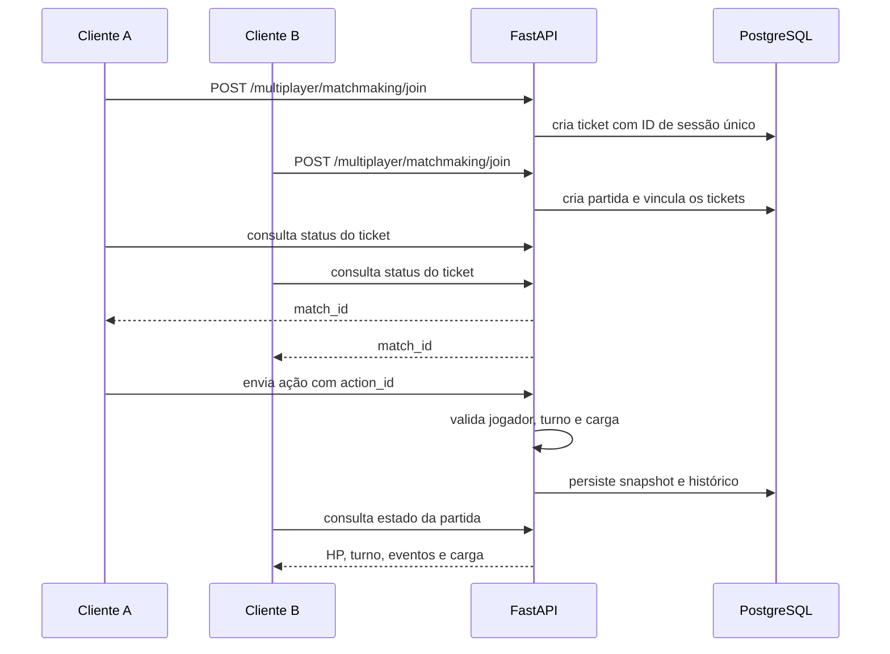

# PokePY

Jogo 2D em Python com cliente Pygame, API REST em FastAPI, persistência PostgreSQL e batalhas multiplayer por matchmaking.


## Visão geral

PokePY possui duas aplicações separadas:

- **Cliente desktop:** exploração, inventário, batalha, ranking e multiplayer em Pygame.
- **Backend:** API FastAPI responsável por ranking, progresso, fila, partidas e validação das ações online.

```text
Cliente PokePY -> HTTPS -> FastAPI no Render -> PostgreSQL no Supabase
```

O cliente nunca recebe credenciais do banco. A URL pública da API é incorporada na distribuição, enquanto `DATABASE_URL` permanece somente nas variáveis privadas do Render.

> Projeto fan-made e educacional, sem vínculo oficial com Pokémon. Assets de terceiros devem ser substituídos antes de qualquer uso comercial.

## Funcionalidades

- exploração em três zonas;
- encontros, itens, inventário e chefe final;
- time com três Pokémon e progressão por XP;
- ranking online dos menores tempos;
- progresso persistente;
- matchmaking online;
- batalha multiplayer por turnos;
- API documentada em `/docs`;
- executável distribuível com configuração online incorporada.

## Controles

| Contexto | Controle |
| --- | --- |
| Movimento | Setas ou `WASD` |
| Inventário | `B` |
| Multiplayer | `M` |
| Ranking | `R` |
| Ataque básico | `Z` |
| Ataque especial | `X`, quando carregado |
| Cura | `C` |
| Troca de Pokémon | `V` |
| Voltar/sair | `Esc` |

## Regras de combate

O ataque especial usa um sistema de carga:

1. dois ataques básicos carregam o especial;
2. enquanto a carga está incompleta, somente o ataque básico é exibido;
3. ao completar a carga, o ataque básico é ocultado e o especial é exibido;
4. o especial consome a carga e causa **35% de dano adicional**;
5. as mesmas regras são validadas no modo história e no servidor multiplayer.

A exigência de XP por nível utiliza 70% da curva original, uma redução de 30%.

## Fluxo multiplayer



O nome visível não identifica uma conexão multiplayer. Cada instância recebe um UUID próprio, permitindo que dois jogadores usem o mesmo nome sem compartilhar ticket. Tickets abandonados expiram e também podem ser cancelados pelo cliente.

O servidor é autoritativo: dano, carga, turno, cura, troca e vitória são processados na API. O cliente apenas envia intenções e renderiza o snapshot recebido.

## Ranking, API e banco

O ranking pode ser aberto a qualquer momento pelo botão na tela de exploração ou pela tecla `R`.

| Tabela | Responsabilidade |
| --- | --- |
| `leaderboard_scores` | tempos de conclusão |
| `player_progress` | zona, posição, itens e time |
| `multiplayer_tickets` | fila e vínculo com partida |
| `multiplayer_matches` | snapshot autoritativo |
| `multiplayer_actions` | histórico idempotente de ações |

Endpoints principais:

| Método | Endpoint | Uso |
| --- | --- | --- |
| `GET` | `/health` | disponibilidade da API |
| `GET` | `/health/ready` | disponibilidade do banco |
| `GET` | `/leaderboard` | melhores tempos |
| `POST` | `/leaderboard` | registrar conclusão |
| `PUT` | `/players/{player_id}/progress` | salvar progresso |
| `POST` | `/multiplayer/matchmaking/join` | entrar na fila |
| `POST` | `/multiplayer/matchmaking/{ticket_id}/cancel` | cancelar fila |
| `GET` | `/multiplayer/matches/{match_id}` | consultar partida |
| `POST` | `/multiplayer/matches/{match_id}/actions` | enviar ação |

Detalhes: [`PokePY/docs/API_DATABASE_MULTIPLAYER.md`](PokePY/docs/API_DATABASE_MULTIPLAYER.md).

## Arquitetura

```text
PokePY/
  api/                aplicação FastAPI, rotas e schemas
  data/               catálogos e definições estáticas
  distribution/       configuração em source e executável
  domain/             entidades e sessão
  game/states/        estados da state machine
  infrastructure/     HTTP, JSON, SQLAlchemy e assets
  services/           regras de negócio
  ui/                 telas e componentes Pygame
migrations/           migrações Alembic
scripts/              validação, deploy e packaging
tests/                testes automatizados
```

As dependências apontam para dentro: a interface e a infraestrutura usam contratos e serviços; regras centrais não dependem do Pygame nem do banco.

## Executar pelo código-fonte

Requer Python 3.11.

```powershell
python -m venv .venv
.\.venv\Scripts\Activate.ps1
python -m pip install --upgrade pip
pip install -r requirements-dev.txt
python -m PokePY.main
```

Duas instâncias para testar multiplayer:

```powershell
Start-Process powershell -ArgumentList "-NoExit", "-Command", ".\.venv\Scripts\Activate.ps1; python -m PokePY.main"
Start-Process powershell -ArgumentList "-NoExit", "-Command", ".\.venv\Scripts\Activate.ps1; python -m PokePY.main"
```

## Verificar a API online

```powershell
python scripts/check_online_api.py
```

Gravação de teste no ranking:

```powershell
python scripts/check_online_api.py --write-test-score
```

## Qualidade

```powershell
pytest
ruff check PokePY tests scripts
mypy PokePY
python -m compileall -q PokePY tests scripts
```

## Deploy

A API online usa Render e o banco usa o Session Pooler do Supabase. Senhas e URLs de banco não pertencem ao repositório.

Guia: [`PokePY/docs/RENDER_DEPLOY_PTBR.md`](PokePY/docs/RENDER_DEPLOY_PTBR.md).

Relatório da versão: [`PokePY/docs/FINAL_VALIDATION.md`](PokePY/docs/FINAL_VALIDATION.md).
