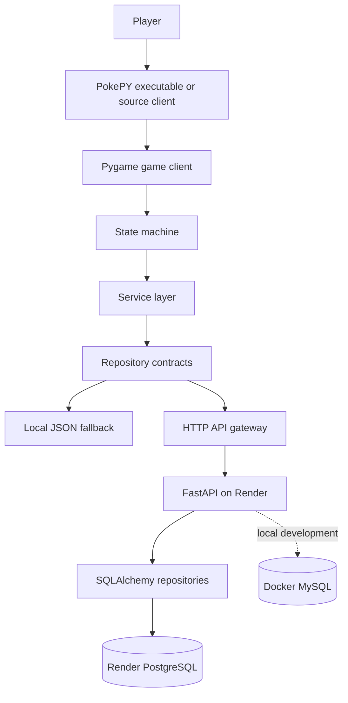

<div align="center">

# PokePY

**Python 2D RPG client with FastAPI backend, persistent ranking, player progress and REST-based multiplayer.**


[](PokePY/docs/EVALUATOR_GUIDE.md)
[](PokePY/docs/ARCHITECTURE.md)
[](PokePY/docs/API_REFERENCE.md)
[](PokePY/docs/RENDER_DEPLOYMENT_PTBR.md)
[](PokePY/docs/DISTRIBUTION_GUIDE_PTBR.md)
[](PokePY/docs/TECHNICAL_INVENTORY.md)

</div>

## Overview

PokePY is an educational software project that combines a Pygame client with a FastAPI backend. The application includes local gameplay, player progress, a fastest-clear ranking, online matchmaking, turn-based multiplayer actions, automated tests, Docker-based development infrastructure and cloud deployment support.

The codebase is organized to demonstrate software architecture rather than isolated scripts. The game client uses a state machine; business rules live in service classes; persistence is accessed through repository contracts; the API exposes REST endpoints; SQLAlchemy handles relational persistence; Alembic manages migrations; PyInstaller builds a player-friendly executable.

> Public repository note: this is a fan-made educational programming project. Assets and names are used for study purposes and can be replaced by original assets for commercial or production use.

## Evaluation snapshot

| Area | Evidence in the repository |
|---|---|
| Python | Type hints, dataclasses, enums, modular packages, services and contracts |
| Game development | Pygame loop, sprites, map masks, state machine, battle UI and inventory UI |
| Backend | FastAPI application, routers, Pydantic schemas, error handlers and OpenAPI docs |
| Persistence | JSON local fallback, SQLAlchemy repositories, MySQL for local Docker and PostgreSQL for Render |
| Multiplayer | Matchmaking queue, match session snapshots, turn validation, action history and idempotent `action_id` |
| Distribution | PyInstaller build scripts, bundled assets and hosted API configuration file |
| Testing | Pytest, fixtures, API integration tests, repository tests and coverage command |
| DevOps | Docker Compose, Render Blueprint, Alembic migrations, GitHub Actions and pre-commit |

## Architecture



The Pygame client never connects directly to the production database. The executable communicates with the hosted API. The API validates requests, applies rules and persists data. Local JSON remains available as a fallback for offline development.

## Project structure

```text
PokePY/
  api/                    FastAPI application, routes, schemas and configuration
  data/                   Static catalogs used by the game
  distribution/           Runtime configuration helpers for source and executable builds
  domain/                 Core entities and game session models
  game/                   State machine and game-state handlers
  infrastructure/         JSON repositories, HTTP gateway, SQLAlchemy repositories and assets
  services/               Business rules, contracts, multiplayer rules and serializers
  ui/                     Pygame views, widgets, fonts, battle and multiplayer screens
  docs/                   Architecture, API, deployment, distribution and study material
migrations/               Alembic migration scripts
scripts/                  Setup, tests, local execution and executable build scripts
packaging/                Client configuration examples for packaged releases
.github/                  CI, issue templates, PR template and dependency updates
```

## Two execution modes

### Player mode: executable

The release executable is built with PyInstaller. It includes the game code, dependencies and visual assets. Ranking, progress and multiplayer use the hosted API URL embedded in `pokepy_client.json` during the build.

```powershell
pip install -r requirements-build.txt
python scripts/build_executable.py --api-url https://your-pokepy-api.onrender.com
```

The generated package appears in `dist/`.

### Developer mode: full source

The complete source can run locally with JSON storage, Docker + MySQL, or a hosted Render API.

```bash
python -m venv .venv
source .venv/bin/activate
pip install -r requirements-dev.txt
python -m PokePY.main
```

Windows PowerShell:

```powershell
python -m venv .venv
.\.venv\Scripts\Activate.ps1
pip install -r requirements-dev.txt
python -m PokePY.main
```

## Local API + MySQL

```bash
docker compose up --build
```

API docs:

```text
http://127.0.0.1:8000/docs
```

Run the client against the local API:

```bash
export POKEPY_BACKEND_MODE=api
export POKEPY_LEADERBOARD_BACKEND=api
export POKEPY_PROGRESS_BACKEND=api
export POKEPY_API_BASE_URL=http://127.0.0.1:8000
python -m PokePY.main
```

Windows PowerShell:

```powershell
$env:POKEPY_BACKEND_MODE="api"
$env:POKEPY_LEADERBOARD_BACKEND="api"
$env:POKEPY_PROGRESS_BACKEND="api"
$env:POKEPY_API_BASE_URL="http://127.0.0.1:8000"
python -m PokePY.main
```

## Render deployment

The repository includes a Render Blueprint:

```text
render.yaml
```

The blueprint defines:

- one FastAPI web service;
- one PostgreSQL database;
- Alembic migration execution before server startup;
- health check path;
- environment variables for database connection and API behavior.

Deployment guide:

```text
PokePY/docs/RENDER_DEPLOYMENT_PTBR.md
```

## API endpoints

| Method | Path | Purpose |
|---|---|---|
| `GET` | `/health` | Basic service status |
| `GET` | `/health/ready` | Database readiness check |
| `POST` | `/leaderboard` | Save a completed run time |
| `GET` | `/leaderboard` | List best times |
| `GET` | `/leaderboard/page` | Paginated ranking |
| `PUT` | `/players/{player_id}/progress` | Save player progress |
| `GET` | `/players/{player_id}/progress` | Load player progress |
| `POST` | `/multiplayer/matchmaking/join` | Enter matchmaking queue |
| `GET` | `/multiplayer/matchmaking/status/{ticket_id}` | Poll matchmaking status |
| `GET` | `/multiplayer/matches/{match_id}` | Read match snapshot |
| `POST` | `/multiplayer/matches/{match_id}/actions` | Submit a multiplayer action |
| `POST` | `/multiplayer/matches/{match_id}/leave` | Leave a match |

Full API reference:

```text
PokePY/docs/API_REFERENCE.md
```

## Tests and quality

```bash
pytest
pytest --cov=PokePY --cov-report=term-missing
ruff check PokePY tests
black --check PokePY tests
mypy PokePY
```

Windows shortcut:

```powershell
.\scripts\run_tests.ps1
```

Linux/macOS shortcut:

```bash
./scripts/run_tests.sh
```

## Documentation map

| File | Purpose |
|---|---|
| `PokePY/docs/EVALUATOR_GUIDE.md` | Fast technical reading for evaluators |
| `PokePY/docs/ARCHITECTURE.md` | Code architecture, layers and design decisions |
| `PokePY/docs/API_REFERENCE.md` | Endpoint reference and payload examples |
| `PokePY/docs/RENDER_DEPLOYMENT_PTBR.md` | Render hosting guide |
| `PokePY/docs/DISTRIBUTION_GUIDE_PTBR.md` | Executable build and release guide |
| `PokePY/docs/TECHNICAL_INVENTORY.md` | Technologies, concepts and examples by category |
| `PokePY/docs/STUDY_GUIDE_PTBR.md` | Study guide for the stack used in the project |
| `PokePY/docs/GITHUB_SETUP_PTBR.md` | GitHub publication workflow from zero |

## License and assets

The project source code can use an open-source license defined in `LICENSE`. Visual assets may have separate restrictions and should be replaced by original assets for commercial distribution.
