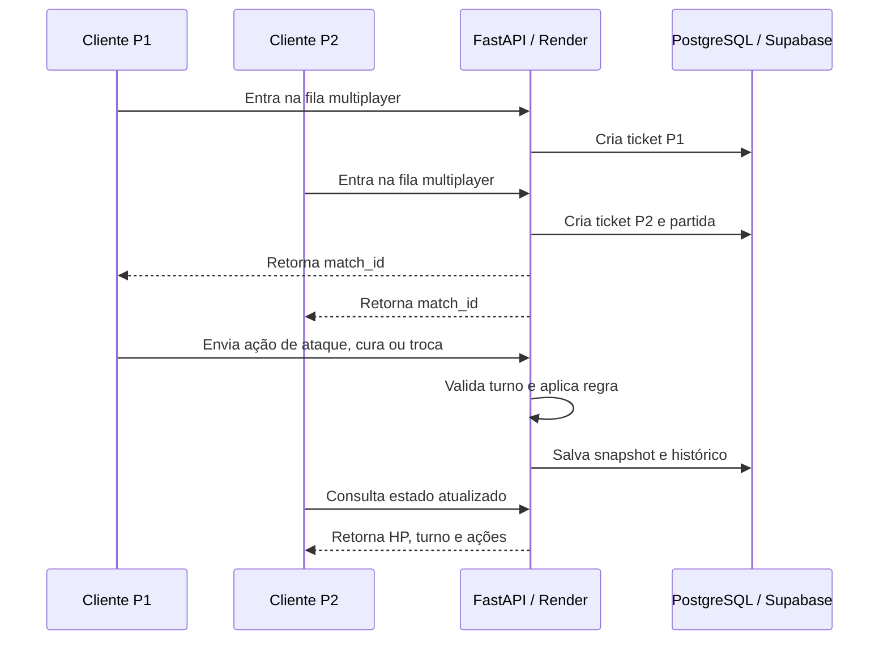

# PokePY

Jogo 2D em Python com cliente Pygame, API REST em FastAPI, persistência relacional e multiplayer por matchmaking.


## Visão geral

PokePY é um projeto educacional de desenvolvimento de software com duas partes principais:

- **Cliente do jogo**: aplicação desktop em Python/Pygame, com exploração, batalhas, inventário, seleção de time, ranking e tela multiplayer.
- **Backend**: API REST em FastAPI responsável por ranking, progresso do jogador, matchmaking e sincronização de ações multiplayer.

O cliente não acessa o banco de dados diretamente. Em modo online, ele envia requisições HTTP para a API. A API valida as regras, grava os dados e devolve o estado atualizado ao cliente.

> Projeto fan-made para fins educacionais. Os assets podem ser substituídos por recursos autorais em uma distribuição comercial.

## Download do executável

A forma mais simples de jogar é baixar a versão para Windows pela página de releases:

[Baixar PokePY para Windows](https://github.com/Edu0032/PokePyGame/releases/latest)

A versão executável já vem configurada para se conectar à API hospedada:

```text
Executável Windows -> API FastAPI no Render -> PostgreSQL no Supabase
```

Não é necessário instalar Python, banco de dados, Docker ou rodar a API localmente.

A API pública configurada para esta versão é:

```text
https://pokepygame.onrender.com
```

Serviços gratuitos podem levar alguns segundos para responder na primeira conexão após um período de inatividade.

## O que o projeto demonstra

| Área | Demonstração prática |
| --- | --- |
| Python | POO, dataclasses, enums, type hints, organização em pacotes e serviços |
| Game dev | Loop Pygame, telas, sprites, mapa, colisão, batalha e inventário |
| Arquitetura | State Machine, camadas de domínio, serviços, infraestrutura e UI |
| Backend | FastAPI, rotas REST, schemas Pydantic, tratamento de erros e OpenAPI |
| Banco de dados | SQLAlchemy, repositórios, migrações Alembic, MySQL local e PostgreSQL online |
| Multiplayer | Fila de matchmaking, sessão de partida, turno, validação de ações e histórico |
| Distribuição | Build com PyInstaller e configuração de API hospedada |
| Qualidade | Pytest, CI no GitHub Actions, Docker Compose e documentação técnica |

## Fluxo multiplayer na prática



O multiplayer usa polling HTTP. Cada cliente consulta a API periodicamente e envia ações somente quando é seu turno. A API mantém o estado oficial da partida, evitando que cada cliente tenha uma versão diferente do combate.

## API e banco de dados

A API persiste três grupos principais de dados:

1. **Ranking**: menor tempo para concluir o jogo.
2. **Progresso do jogador**: nome, zona, posição, itens e time atual.
3. **Multiplayer**: tickets de fila, partidas, estado atual e histórico de ações.

Endpoints principais:

| Método | Rota | Função |
| --- | --- | --- |
| `GET` | `/health` | Verifica se a API está online |
| `GET` | `/health/ready` | Verifica se API e banco estão prontos |
| `GET` | `/leaderboard` | Lista os melhores tempos |
| `POST` | `/leaderboard` | Registra uma vitória no ranking |
| `PUT` | `/players/{player_id}/progress` | Salva progresso do jogador |
| `GET` | `/players/{player_id}/progress` | Lê progresso salvo |
| `POST` | `/multiplayer/matchmaking/join` | Entra na fila multiplayer |
| `GET` | `/multiplayer/matchmaking/status/{ticket_id}` | Consulta status da fila |
| `GET` | `/multiplayer/matches/{match_id}` | Lê estado da partida |
| `POST` | `/multiplayer/matches/{match_id}/actions` | Envia ataque, cura, troca ou saída |

Documentação detalhada: [`PokePY/docs/API_DATABASE_MULTIPLAYER.md`](PokePY/docs/API_DATABASE_MULTIPLAYER.md).

## Estrutura do repositório

```text
PokePY/
  api/                 Aplicação FastAPI, rotas, schemas e dependências
  data/                Catálogos estáticos do jogo
  distribution/        Leitura de configuração para código-fonte e executável
  domain/              Entidades, sessão e modelos de domínio
  game/                State machine e estados do jogo
  infrastructure/      Repositórios JSON, HTTP, SQLAlchemy e assets
  services/            Regras de negócio, ranking, progresso e multiplayer
  ui/                  Telas e componentes Pygame
  sprites/             Imagens do jogo
  backgrounds/         Fundos de batalha
  mapa/                Mapas e máscaras de colisão
migrations/            Migrações Alembic
scripts/               Execução, testes, deploy e build de executável
packaging/             Configuração usada no build do executável
PokePY/docs/           Documentação técnica objetiva
```

## Rodar localmente como desenvolvedor

```bash
python -m venv .venv
```

Windows PowerShell:

```powershell
.\.venv\Scripts\Activate.ps1
pip install -r requirements-dev.txt
python -m PokePY.main
```

Linux/macOS:

```bash
source .venv/bin/activate
pip install -r requirements-dev.txt
python -m PokePY.main
```

Por padrão, o jogo pode rodar com arquivos JSON locais. Isso permite testar o cliente sem API e sem banco.

## Rodar API local com MySQL

```bash
docker compose up --build
```

Depois acesse:

```text
http://127.0.0.1:8000/docs
```

Rodar o cliente conectado à API local no Windows:

```powershell
.\scripts\run_game_online.ps1 -ApiUrl "http://127.0.0.1:8000"
```

Linux/macOS:

```bash
./scripts/run_game_online.sh "http://127.0.0.1:8000"
```

## Deploy da API no Render

O deploy online usa:

```text
Render Web Service -> FastAPI
Supabase Session Pooler -> PostgreSQL
```

O arquivo `render.yaml` configura o serviço web. A URL do banco fica somente nas variáveis de ambiente do Render.

Guia completo: [`PokePY/docs/RENDER_DEPLOY_PTBR.md`](PokePY/docs/RENDER_DEPLOY_PTBR.md).

## Configurar o cliente com a API hospedada

A URL pública da API desta versão é:

```text
https://pokepygame.onrender.com
```

Para gravar essa URL nos arquivos usados pelo código-fonte e pelo executável:

```bash
python scripts/configure_api_url.py --api-url "https://pokepygame.onrender.com"
```

Isso atualiza:

```text
pokepy_client.json
packaging/pokepy_client.json
```

## Gerar executável

Windows:

```powershell
python -m venv .venv
.\.venv\Scripts\Activate.ps1
pip install --upgrade pip
pip install -r requirements-build.txt
python scripts/build_executable.py --api-url "https://pokepygame.onrender.com" --onedir
```

O resultado fica em `dist/`. Compacte a pasta gerada e anexe o `.zip` em uma GitHub Release.

Guia completo: [`PokePY/docs/EXECUTABLE_PTBR.md`](PokePY/docs/EXECUTABLE_PTBR.md).

## Testes

```bash
pip install -r requirements-dev.txt
pytest
```

Com cobertura:

```bash
pytest --cov=PokePY --cov-report=term-missing
```

## Publicação no GitHub

Guia prático: [`PokePY/docs/GITHUB_SETUP_PTBR.md`](PokePY/docs/GITHUB_SETUP_PTBR.md).

## Resumo para currículo

**PokePY — jogo 2D com API REST, banco de dados e multiplayer**  
Projeto educacional em Python com Pygame, FastAPI, SQLAlchemy, MySQL/PostgreSQL, Docker e Pytest. Inclui arquitetura em camadas, state machine, ranking persistente, progresso do jogador, matchmaking multiplayer, API REST documentada e build de executável com PyInstaller.
